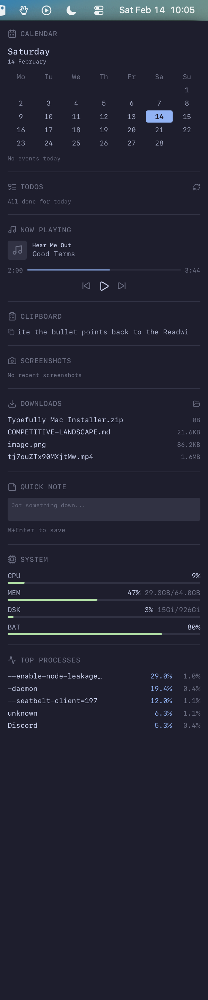

<p align="center">
  
</p>

<h1 align="center">sidebar</h1>

<p align="center">
  A permanent desktop dashboard for macOS, pinned to the right edge of your widescreen monitor.
</p>

<p align="center">
  <a href="#how-it-works">How it works</a> ·
  <a href="#widgets">Widgets</a> ·
  <a href="#setup">Setup</a> ·
  <a href="#customization">Customization</a>
</p>

## Why?

Widescreen monitors have too much horizontal space. Most of it sits empty while you work in the center. This project turns that dead zone into a glanceable dashboard with everything you care about: calendar, tasks, music, system stats, clipboard history, recent files.

It's always visible, never steals focus, and disappears automatically when you undock your laptop.

<p align="center">
  
</p>

## How it works

The sidebar is a **Svelte + Tailwind** app running inside a **Hammerspoon webview** pinned to the right 300px of your external display.

```
┌───────────────────────────────────┐
│          Your monitor             │
│                                   │
│  ┌───────────────────┐ ┌───────┐ │
│  │  App windows       │ │Sidebar│ │
│  │  (2260px usable)   │ │(300px)│ │
│  │                    │ │       │ │
│  └───────────────────┘ └───────┘ │
└───────────────────────────────────┘
```

- **Hammerspoon** creates a borderless, floating, non-activating webview (you can click through it, it never steals focus)
- **`hs.screen.watcher`** detects dock/undock and auto-hides the sidebar when your external monitor disconnects
- **Window management** via CapsLock (Hyper key) + arrow keys is sidebar-aware: splits only use the 2260px outside the sidebar
- **Two-way communication**: Svelte talks to Lua via `webkit.messageHandlers`, Lua pushes data back via `evaluateJavaScript()`

### Dev vs Prod

- **Dev**: Hammerspoon webview points at `http://localhost:5174` (Vite dev server with HMR)
- **Prod**: `bun run build`, then Hammerspoon loads `file:///path/to/dist/index.html` directly

## Widgets

| Widget | Data source | Update interval |
|--------|------------|-----------------|
| **Calendar** | Static (date + mini month grid) | On load |
| **Todoist** | Todoist API v1 (direct fetch) | 2 min |
| **Now Playing** | `hs.spotify` | 5s |
| **Clipboard** | `hs.pasteboard` | 2s |
| **Screenshots** | `~/Desktop/Screenshot*.png` | 30s |
| **Downloads** | `~/Downloads` (recent files) | 30s |
| **Quick Note** | Saves to Obsidian vault via Lua | On submit |
| **System Stats** | `hs.host.cpuUsage`, `hs.host.vmStat`, `df`, `hs.battery` | 10s |
| **Top Processes** | `ps aux` | 10s |

## Setup

### Prerequisites

- macOS with an external monitor
- [Hammerspoon](https://www.hammerspoon.org/) (`brew install --cask hammerspoon`)
- [Karabiner-Elements](https://karabiner-elements.pqrs.org/) with CapsLock mapped to Hyper (ctrl+alt+cmd+shift)
- [Bun](https://bun.sh/)
- Accessibility permissions for Hammerspoon (System Settings > Privacy & Security > Accessibility)

### Install

```bash
git clone https://github.com/sasha-computer/sidebar.git
cd sidebar
bun install
```

### Configure

Edit `hammerspoon/sidebar.lua`:

- `SIDEBAR_WIDTH` (default: 300)
- `EXTERNAL_DISPLAY` (default: "LG UltraFine") - change to match your monitor name
- `NOTES_PATH` - path to your notes directory
- `USE_DEV` - `true` for dev server, `false` for production build

Edit `hammerspoon/init.lua`:

- The Todoist token is read from 1Password at startup. Replace the `io.popen` line with your own token source, or hardcode it (not recommended).

### Link Hammerspoon config

```bash
ln -sf "$(pwd)/hammerspoon/init.lua" ~/.hammerspoon/init.lua
```

### Run (dev mode)

```bash
bun run dev    # Start Vite on :5174
# Hammerspoon auto-reloads when .lua files change
```

### Build (prod mode)

```bash
bun run build  # Outputs to dist/
# Set USE_DEV = false in sidebar.lua
# Reload Hammerspoon
```

## Window Management

CapsLock is remapped to Hyper (ctrl+alt+cmd+shift) via Karabiner. Hammerspoon binds:

| Shortcut | Action |
|----------|--------|
| Hyper + Left | Left half (sidebar-aware) |
| Hyper + Right | Right half (sidebar-aware) |
| Hyper + Up | Maximize (sidebar-aware) |
| Hyper + Down | Center 60% |
| Hyper + Return | Toggle fullscreen |
| Hyper + S | Toggle sidebar |

When undocked (no external monitor), splits use the full screen width.

## Customization

### Adding a widget

1. Create `src/widgets/MyWidget.svelte`
2. Add a store in `src/lib/stores.ts` if needed
3. Import and add it to `src/App.svelte`
4. If the widget needs macOS data, add a collector function in `hammerspoon/sidebar.lua` and push data via `pushToWebview()`

### Theme

Colors are defined in `src/app.css` using Catppuccin Mocha. Change the `@theme` block to use your palette.

### Monitor

Change `EXTERNAL_DISPLAY` in `sidebar.lua` to match your monitor's name. Find yours with:

```bash
hs -c 'for _, s in ipairs(hs.screen.allScreens()) do print(s:name()) end'
```

## Stack

- **UI**: Svelte 5 + Tailwind v4 + Lucide icons
- **Host**: Hammerspoon `hs.webview` (WKWebView)
- **Bundler**: Vite (via Bun)
- **Font**: Berkeley Mono
- **Theme**: Catppuccin Mocha

## License

MIT
